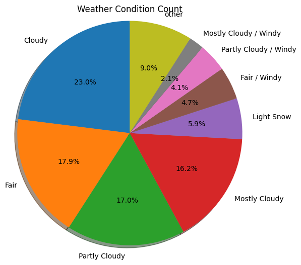
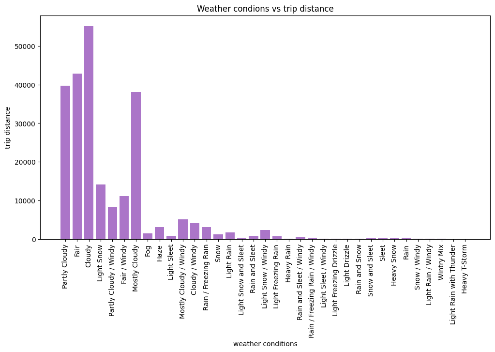
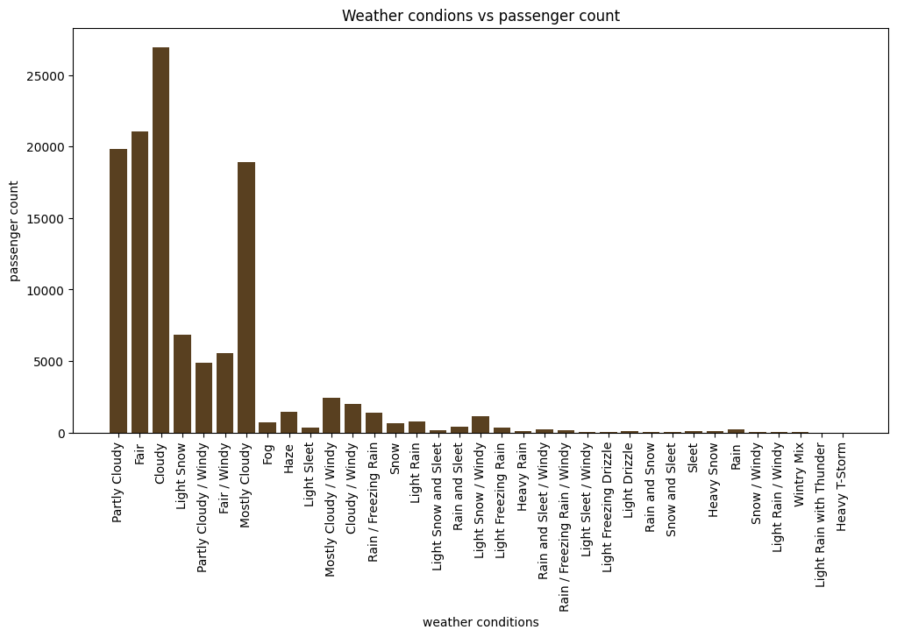
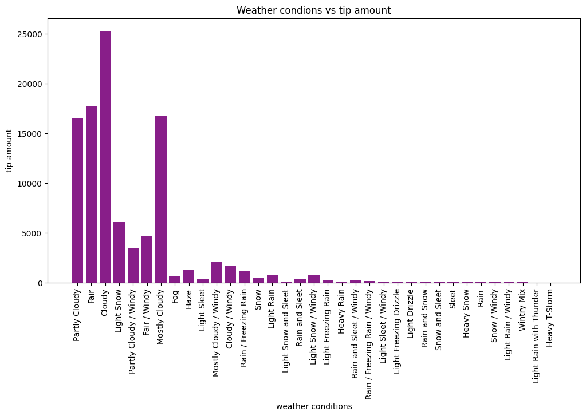
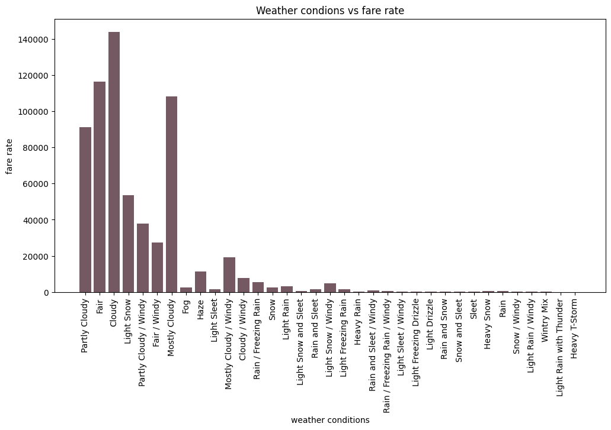
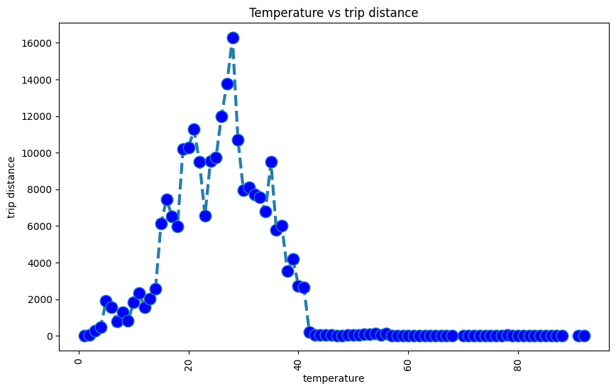
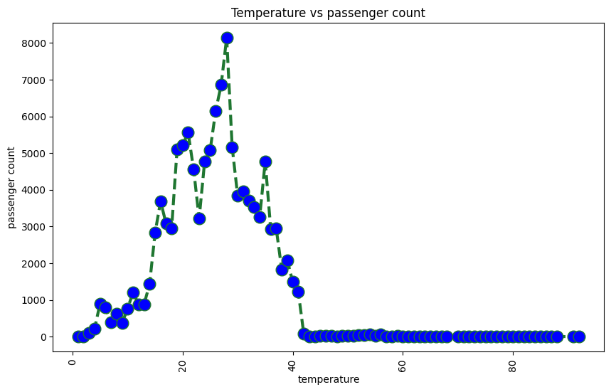
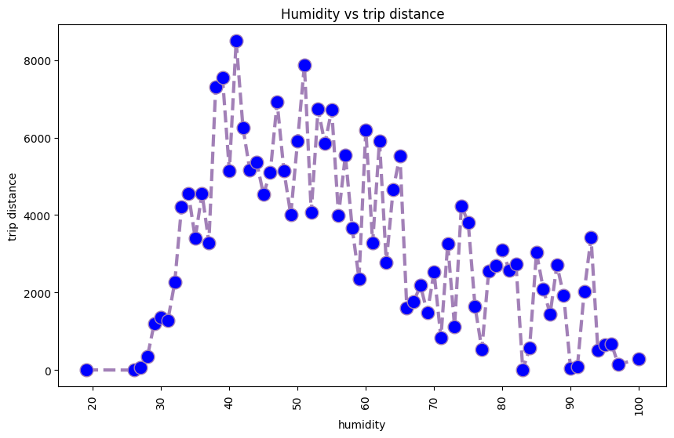
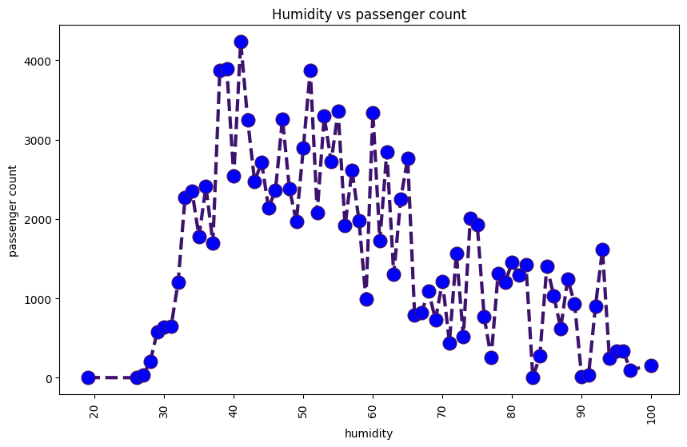
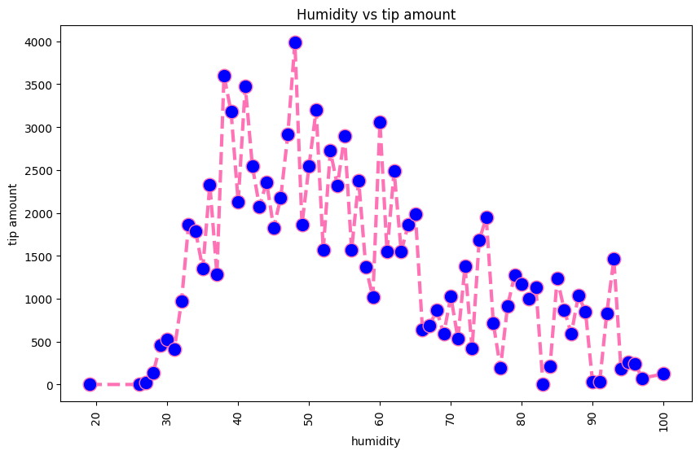

# Introduction
My plan is to see the impact of weather conditions on taxi travel in New York City. For that, I have collected the New York Green taxi data for the year 2015 from the NYC Open Data website (https://opendata.cityofnewyork.us/ ). And I scraped the Weather Underground Website's (https://www.wunderground.com)  hourly data of 28 private and public weather stations data. And analyzed to overview the weather effect on Green Taxi travel. My target was to match the latitude, and longitude of travel data with weather station data to get the closest weather station, then get the weather information from the weather station data depending on the date and time. Then work on visualization. The target comparison I wanted to make is 

1. weather effect on travel count, Which weather people travel most or least
2. Weather effect on cost
3. which weather people travel long distance.


 
# Dataset Description
The NYC Green Taxi data contains 21 columns and 19.2 million rows. All journeys made in NYC's green taxis in 2015 are represented in this dataset. Pick-up and drop-off times and locations, trip lengths, itemized rates, rate kinds, payment methods, and driver-reported passenger counts are all captured in the records. The NYC Taxi and Limousine Commission (TLC) received the information utilized in the datasets attached from technology suppliers accredited by the Taxicab Passenger Enhancement Program (TPEP). 

Weather Underground data that is scraped contains hourly weather information. It has 10 columns and over 245k rows. I have selected 28 weather stations in New York City. Each station data contains 24hr X 365 days of weather information. Here is an example of the data.
It took over 30 hours to collect weather information from 28 weather stations.

## Raw Green Taxi Data of year 2015
|vendorid|pickup_datetime       |dropoff_datetime      |Store_and_fwd_flag|rate_code|Pickup_longitude   |Pickup_latitude   |Dropoff_longitude  |Dropoff_latitude  |Passenger_count|Trip_distance|Fare_amount|Extra|MTA_tax|Tip_amount|Tolls_amount|Ehail_fee|Improvement_surcharge|Total_amount|Payment_type|Trip_type|
|--------|----------------------|----------------------|------------------|---------|-------------------|------------------|-------------------|------------------|---------------|-------------|-----------|-----|-------|----------|------------|---------|---------------------|------------|------------|---------|
|2       |02/10/2015 08:46:15 AM|02/10/2015 08:59:50 AM|N                 |1        |-73.828262329101563|40.693958282470703|-73.776329040527344|40.645347595214844|1              |5.95         |19         |0    |0.5    |4.75      |0           |         |0.3                  |24.55       |1           |1        |
|2       |01/09/2015 03:45:22 PM|01/09/2015 03:54:32 PM|N                 |1        |-73.985671997070313|40.669933319091797|-73.998367309570312|40.679828643798828|3              |1.15         |7.5        |0    |0.5    |1.5       |0           |         |0.3                  |9.8         |1           |1        |
|2       |01/16/2015 10:07:38 PM|01/16/2015 10:14:25 PM|N                 |1        |-73.892570495605469|40.746658325195313|-73.909294128417969|40.736202239990234|1              |1.74         |7.5        |0.5  |0.5    |0         |0           |         |0.3                  |8.8         |2           |1        |
|2       |02/11/2015 08:12:29 PM|02/11/2015 08:16:39 PM|N                 |1        |-73.952033996582031|40.714122772216797|-73.957847595214844|40.710945129394531|1              |0.5          |5          |0.5  |0.5    |0         |0           |         |0.3                  |6.3         |2           |1        |
|2       |02/26/2015 10:42:27 AM|02/26/2015 10:57:30 AM|N                 |1        |-73.89410400390625 |40.750774383544922|-73.912811279296875|40.755722045898437|2              |1.8          |11         |0    |0.5    |0         |0           |         |0.3                  |11.8        |2           |1        |
|1       |02/02/2015 06:46:40 PM|02/02/2015 06:58:08 PM|N                 |1        |-73.925422668457031|40.761699676513672|-73.915641784667969|40.749153137207031|1              |1.3          |8.5        |1    |0.5    |0         |0           |         |0.3                  |10.3        |2           |1        |
|2       |02/17/2015 05:04:16 AM|02/17/2015 05:34:04 AM|N                 |1        |-73.927223205566406|40.692600250244141|-73.918312072753906|40.651378631591797|1              |3.47         |17         |0.5  |0.5    |0         |0           |         |0.3                  |18.3        |1           |1        |


## Processed Station Data

|station_id|station_lat|station_lon|weather_date_time  |temperature|dew_point|humidity|wind|wind_speed|wind_gust|pressure|precipation|condition    |
|----------|-----------|-----------|-------------------|-----------|---------|--------|----|----------|---------|--------|-----------|-------------|
|KNJHOBOK63|40.74      |-74.03     |2015-01-01 00:51:00|22         |10       |60      |SW  |6         |0        |30      |0          |Fair         |
|KNJHOBOK63|40.74      |-74.03     |2015-01-01 01:51:00|24         |12       |60      |SSW |7         |0        |30      |0          |Fair         |
|KNJHOBOK63|40.74      |-74.03     |2015-01-01 02:51:00|23         |10       |58      |SW  |6         |0        |30      |0          |Partly Cloudy|
|KNJHOBOK63|40.74      |-74.03     |2015-01-01 03:51:00|23         |10       |58      |SW  |7         |0        |30      |0          |Fair         |
|KNJHOBOK63|40.74      |-74.03     |2015-01-01 04:51:00|24         |8        |51      |SW  |5         |0        |30      |0          |Fair         |
|KNJHOBOK63|40.74      |-74.03     |2015-01-01 05:51:00|22         |8        |55      |SSW |5         |0        |30      |0          |Fair         |
|KNJHOBOK63|40.74      |-74.03     |2015-01-01 06:51:00|21         |9        |60      |SSW |6         |0        |30      |0          |Fair         |


## Final Processed Data (Combined with weather information)

|vendorid|pickup_datetime    |dropoff_datetime   |store_and_fwd_flag|rate_code|pickup_longitude   |pickup_latitude   |dropoff_longitude  |dropoff_latitude  |passenger_count|trip_distance|fare_amount|extra|mta_tax|tip_amount|tolls_amount|ehail_fee|improvement_surcharge|total_amount|payment_type|trip_type|station_id  |station_lat|station_lon|weather_date_time  |temperature|dew_point|humidity|wind|wind_speed|wind_gust|pressure|precipation|condition    |
|--------|-------------------|-------------------|------------------|---------|-------------------|------------------|-------------------|------------------|---------------|-------------|-----------|-----|-------|----------|------------|---------|---------------------|------------|------------|---------|------------|-----------|-----------|-------------------|-----------|---------|--------|----|----------|---------|--------|-----------|-------------|
|2       |2015-02-10 08:46:15|2015-02-10 08:59:50|N                 |1        |-73.828262329101563|40.693958282470703|-73.776329040527344|40.645347595214844|1              |5.95         |19         |0    |0.5    |4.75      |0           |         |0.3                  |24.55       |1           |1        |KNYNEWYO728 |40.69      |-73.95     |2015-02-10 08:51:00|28         |19       |68      |N   |13        |0        |30      |0          |Cloudy       |
|2       |2015-01-09 15:45:22|2015-01-09 15:54:32|N                 |1        |-73.985671997070313|40.669933319091797|-73.998367309570312|40.679828643798828|3              |1.15         |7.5        |0    |0.5    |1.5       |0           |         |0.3                  |9.8         |1           |1        |KNYNEWYO1299|40.66      |-73.99     |2015-01-09 15:51:00|30         |12       |47      |W   |16        |0        |30      |0          |Partly Cloudy|
|2       |2015-01-16 22:07:38|2015-01-16 22:14:25|N                 |1        |-73.892570495605469|40.746658325195313|-73.909294128417969|40.736202239990234|1              |1.74         |7.5        |0.5  |0.5    |0         |0           |         |0.3                  |8.8         |2           |1        |KNYNEWYO1749|40.72      |-73.95     |2015-01-16 21:51:00|22         |5        |48      |NW  |20        |28       |30      |0          |Fair         |
|2       |2015-02-11 20:12:29|2015-02-11 20:16:39|N                 |1        |-73.952033996582031|40.714122772216797|-73.957847595214844|40.710945129394531|1              |0.5          |5          |0.5  |0.5    |0         |0           |         |0.3                  |6.3         |2           |1        |KNYNEWYO1749|40.72      |-73.95     |2015-02-11 19:51:00|31         |16       |54      |SSE |8         |0        |29      |0          |Partly Cloudy|
|2       |2015-02-26 10:42:27|2015-02-26 10:57:30|N                 |1        |-73.89410400390625 |40.750774383544922|-73.912811279296875|40.755722045898437|2              |1.8          |11         |0    |0.5    |0         |0           |         |0.3                  |11.8        |2           |1        |KNYNEWYO1130|40.74      |-73.96     |2015-02-26 10:51:00|24         |7        |48      |NE  |13        |0        |30      |0          |Cloudy       |
|1       |2015-02-02 18:46:40|2015-02-02 18:58:08|N                 |1        |-73.925422668457031|40.761699676513672|-73.915641784667969|40.749153137207031|1              |1.3          |8.5        |1    |0.5    |0         |0           |         |0.3                  |10.3        |2           |1        |KNYNEWYO1579|40.77      |-73.96     |2015-02-02 18:51:00|23         |17       |78      |NNW |14        |21       |29      |0          |Light Snow   |
|2       |2015-02-17 05:04:16|2015-02-17 05:34:04|N                 |1        |-73.927223205566406|40.692600250244141|-73.918312072753906|40.651378631591797|1              |3.47         |17         |0.5  |0.5    |0         |0           |         |0.3                  |18.3        |1           |1        |KNYNEWYO728 |40.69      |-73.95     |2015-02-17 04:51:00|15         |10       |80      |NE  |12        |0        |29      |0          |Light Snow   |


# Problems needed to overcome:
First, I have selected the dataset of the 2018 Yellow Taxi data, but that dataset does not contain latitude and longitude which is the most important info I need to complete the project. Later started working on the 2015 Yellow taxi data, I figure out that that data does not contain the correct travel date, all travel data contains the same date. As I need to determine the hourly weather so I dropped the idea. Then go to the next plan, and selected the 2015 Green taxi data.

Then I wanted to get the weather information from “https://openweathermap.org/”, and later figure out they don’t provide historical data for free. 

Then I started working on web scrapping on the “Weather Underground website”. The complexity arise when I found the website is built on Angular(A javascript framework). So I started using selenium for web scrapping. 

# Data collection:
### 1. NYC Green Taxi
These data I have just downloaded these from the website and removed the missing rows. Otherwise, the data is already in good shape except some missing data. 

### 2. Weather Underground
As this website is built on Angular (Javascript Framework), It is harder to do web scraping on this website. I used Selenium (a python library) to get the data. There was a table that contains hourly weather info. I used the below code to get the table data.

```python
histories = WebDriverWait(driver, timeout=3).until(lambda d: d.find_elements_by_xpath("//table[@aria-labelledby='History observation']//tr//td[@role='gridcell']"))
```


The data I got here contains some letters, later I remove those in the pre-processing script. 


# Data preprocessing:
I have created the script “pre_processing.ipynb” to preprocess all the data. Webscrped raw data contains 12HR data format, I converted that to 24HR data so that it matches with Taxi data. Then removed all unnecessary text from the data and saved it in the “processed_stations” folder.

For preprocessing taxi raw data. First compared latitude and longitude with station data and get the closest station data and removed the row where latitude or longitude is missing. Then saved the processed data.


# Data analyze

```python
w_condition_vs_trip_distance = {}
w_condition_vs_passenger_count = {}
w_condition_vs_tip_amount = {}

w_condition_vs_fare_rate = {}

temperature_vs_trip_distance = {}
temperature_vs_passenger_count = {}
temperature_vs_tip_amount = {}

precipation_vs_trip_distance = {}
precipation_vs_passenger_count = {}
precipation_vs_tip_amount = {}

humidity_vs_trip_distance = {}
humidity_vs_passenger_count = {}
humidity_vs_tip_amount = {}


w_condition_count = {}


with open("processed_trip_data/green_trip_data_2015_bkp.csv", 'r',) as file:
        reader = csv.DictReader(file, delimiter=',')
        for i,line in enumerate(reader):
            if i == 0:
                continue
            condition = line['condition']
            temperature = float(line['temperature'])
            precipation = float(line['precipation'])
            humidity = float(line['humidity'])
            
            trip_distance_x_passenger_count = (float(line['trip_distance']) * float(line['passenger_count']))
            if trip_distance_x_passenger_count != 0:
                fare_rate = float(line['fare_amount']) / trip_distance_x_passenger_count
            


            if condition in w_condition_vs_trip_distance:
                w_condition_vs_trip_distance[condition] += float(line['trip_distance'])
                w_condition_count[condition] += 1
            else:
                w_condition_vs_trip_distance[condition] = float(line['trip_distance'])
                w_condition_count[condition] = 0

            if condition in w_condition_vs_passenger_count:
                w_condition_vs_passenger_count[condition] += int(line['passenger_count'])
            else:
                w_condition_vs_passenger_count[condition] = int(line['passenger_count'])

            if condition in w_condition_vs_tip_amount:
                w_condition_vs_tip_amount[condition] += float(line['tip_amount'])   
            else:
                w_condition_vs_tip_amount[condition] = float(line['tip_amount'])

            if temperature in temperature_vs_trip_distance:
                temperature_vs_trip_distance[temperature] += float(line['trip_distance'])
            else:
                temperature_vs_trip_distance[temperature] = float(line['trip_distance'])
            
            if temperature in temperature_vs_passenger_count:
                temperature_vs_passenger_count[temperature] += int(line['passenger_count'])
            else:
                temperature_vs_passenger_count[temperature] = int(line['passenger_count'])

            if temperature in temperature_vs_tip_amount:
                temperature_vs_tip_amount[temperature] += float(line['tip_amount'])
            else:
                temperature_vs_tip_amount[temperature] = float(line['tip_amount'])

            if precipation in precipation_vs_trip_distance:
                precipation_vs_trip_distance[precipation] += float(line['trip_distance'])
            else:
                precipation_vs_trip_distance[precipation] = float(line['trip_distance'])

            if precipation in precipation_vs_passenger_count:
                precipation_vs_passenger_count[precipation] += int(line['passenger_count'])
            else:
                precipation_vs_passenger_count[precipation] = int(line['passenger_count'])

            if precipation in precipation_vs_tip_amount:
                precipation_vs_tip_amount[precipation] += float(line['tip_amount'])
            else:
                precipation_vs_tip_amount[precipation] = float(line['tip_amount'])

            if humidity in humidity_vs_trip_distance:
                humidity_vs_trip_distance[humidity] += float(line['trip_distance'])
            else:
                humidity_vs_trip_distance[humidity] = float(line['trip_distance'])

            if humidity in humidity_vs_passenger_count:
                humidity_vs_passenger_count[humidity] += int(line['passenger_count'])
            else:
                humidity_vs_passenger_count[humidity] = int(line['passenger_count'])
            
            if humidity in humidity_vs_tip_amount:
                humidity_vs_tip_amount[humidity] += float(line['tip_amount'])
            else:
                humidity_vs_tip_amount[humidity] = float(line['tip_amount'])


            if condition in w_condition_vs_fare_rate:
                w_condition_vs_fare_rate[condition] += fare_rate
            else:
                w_condition_vs_fare_rate[condition] = fare_rate


```

### Data distribution

At first, I wanted to see the data distributions. here I can see Cloudy weather is 23%, which is the highest. I put the least significant distribution to the others category, which is a total of 9%. The dataset shows some bias which is the nature of the weather.

    

    
### Weather condition vs (trip distance, fare, passenger count, tip)

Then I wanted to analyze the effect of weather on trip distance, fare, tip amount, and passenger count. And found that  People use taxis mostly in Cloudy, Fair, Partly Cloudy, and Mostly cloudy weather. In other weathers, people don't use green taxis that much.

```python
plot_bar_chart(list(w_condition_vs_trip_distance.keys()) ,list(w_condition_vs_trip_distance.values()) ,"weather conditions",'trip distance', 'Weather condions vs trip distance')
plot_bar_chart(list(w_condition_vs_passenger_count.keys()) ,list(w_condition_vs_passenger_count.values()) ,"weather conditions",'passenger count', 'Weather condions vs passenger count')
plot_bar_chart(list(w_condition_vs_tip_amount.keys()) ,list(w_condition_vs_tip_amount.values()) ,"weather conditions",'tip amount', 'Weather condions vs tip amount')
```


    

    


    

    


    

    


```python
plot_bar_chart(list(w_condition_vs_fare_rate.keys()) ,list(w_condition_vs_fare_rate.values()) ,"weather conditions",'fare rate', 'Weather condions vs fare rate')
```


    

    


### Effect of temperature on trip

```python
temperature_vs_trip_distance_sort = sorted(temperature_vs_trip_distance.items(), key=lambda t: get_key(t[0]))
temperature_vs_trip_distance_x = [x[0] for x in temperature_vs_trip_distance_sort]
temperature_vs_trip_distance_y  = [x[1] for x in temperature_vs_trip_distance_sort]
plot_line_graph(temperature_vs_trip_distance_x,temperature_vs_trip_distance_y,"temperature",'trip distance', 'Temperature vs trip distance')

temperature_vs_passenger_count_sort = sorted(temperature_vs_passenger_count.items(), key=lambda t: get_key(t[0]))
temperature_vs_passenger_count_x = [x[0] for x in temperature_vs_passenger_count_sort]
temperature_vs_passenger_count_y  = [x[1] for x in temperature_vs_passenger_count_sort]
plot_line_graph(temperature_vs_passenger_count_x,temperature_vs_passenger_count_y,"temperature",'passenger count', 'Temperature vs passenger count')

temperature_vs_tip_amount_sort = sorted(temperature_vs_tip_amount.items(), key=lambda t: get_key(t[0]))
temperature_vs_tip_amount_x = [x[0] for x in temperature_vs_tip_amount_sort]
temperature_vs_tip_amount_y  = [x[1] for x in temperature_vs_tip_amount_sort]
plot_line_graph(temperature_vs_tip_amount_x,temperature_vs_tip_amount_y,"temperature",'tip amount', 'Temperature vs tip amount')
```
    

    


    

    


    

    


### Effect of humidity on trip

```python
humidity_vs_trip_distance_short = sorted(humidity_vs_trip_distance.items(), key=lambda t: get_key(t[0]))
humidity_vs_trip_distance_x = [x[0] for x in humidity_vs_trip_distance_short]
humidity_vs_trip_distance_y  = [x[1] for x in humidity_vs_trip_distance_short]
plot_line_graph(humidity_vs_trip_distance_x,humidity_vs_trip_distance_y,"humidity",'trip distance', 'Humidity vs trip distance')

humidity_vs_passenger_count_short = sorted(humidity_vs_passenger_count.items(), key=lambda t: get_key(t[0]))
humidity_vs_passenger_count_x = [x[0] for x in humidity_vs_passenger_count_short]
humidity_vs_passenger_count_y  = [x[1] for x in humidity_vs_passenger_count_short]
plot_line_graph(humidity_vs_passenger_count_x,humidity_vs_passenger_count_y,"humidity",'passenger count', 'Humidity vs passenger count')

humidity_vs_tip_amount_short = sorted(humidity_vs_tip_amount.items(), key=lambda t: get_key(t[0]))
humidity_vs_tip_amount_x = [x[0] for x in humidity_vs_tip_amount_short]
humidity_vs_tip_amount_y  = [x[1] for x in humidity_vs_tip_amount_short]
plot_line_graph(humidity_vs_tip_amount_x,humidity_vs_tip_amount_y,"humidity",'tip amount', 'Humidity vs tip amount')


```


    

    


    

    


    

    


